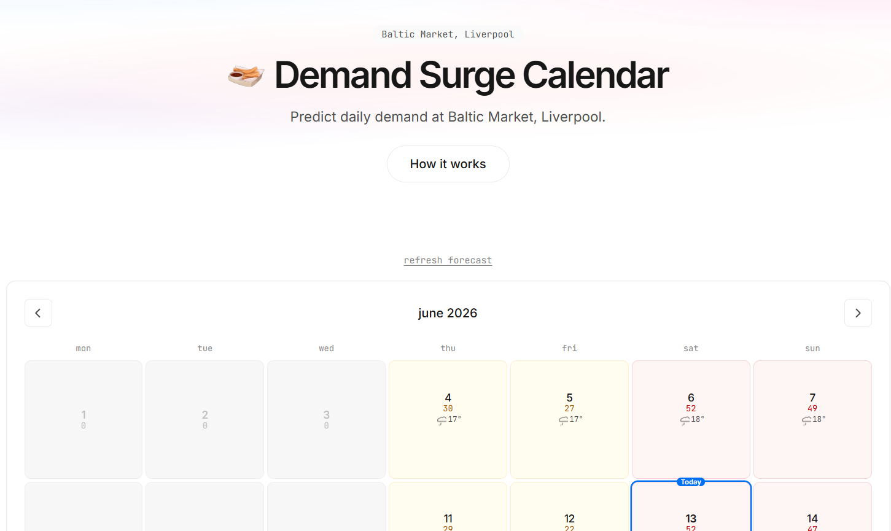
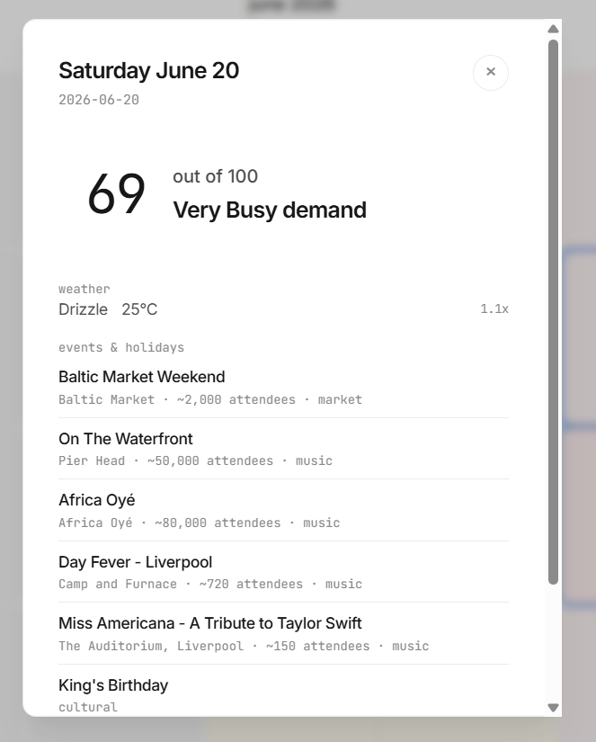

<p align="center">
  
</p>

# Demand Surge Calendar

Predict churro demand at Baltic Market, Liverpool. Know how many staff to bring and how much dough to mix before you open.

**[churro-1.vercel.app](https://churro-1.vercel.app)**

[](https://nextjs.org/) [](./LICENSE)

---

## What this is

A lightweight demand forecasting tool built for a single churro stall at Baltic Market, Liverpool. It shows a color-coded monthly calendar where each day gets a score from 0 to 100, telling you whether tomorrow will be quiet or slammed.

---

## Why it matters

Food stall operators make two costly mistakes every week: overstaffing slow days (burning cash) and understaffing busy days (leaving money on the counter). This tool replaces gut feel with a real forecast. If you run a stall that sells hot food at a fixed market, the difference between guessing and knowing is margin.

<p align="center">
  
  
</p>

---

## How it works

- **Score (0-100)** gets binned into six levels: Closed, Quiet, Steady, Busy, Very Busy, Crush. Click any day to see staffing recommendations, confidence range, weather, nearby events, and a breakdown of what drove the score.
- **Events** pull from Ticketmaster (live concerts, sports, festivals) plus 14 nearby venues and static recurring/annual event data. Each event is decayed by walking distance (Gaussian, sigma 1.5 km) and weighted by category relevance (market crowds buy more churros than football crowds).
- **Weather** uses a churro-specific model, not generic footfall. Peak demand is 11 deg C with light drizzle, when people duck into the covered market for warm comfort food. Heat above 24 deg C and thunderstorms crush demand.
- **Holidays** boost scores by type (school holidays hit harder than cultural dates). Christmas Day and New Year's Day force a market closure override.
- **Day of week** multipliers reflect actual Baltic Market trading hours: Saturday 1.30x (all day peak), Thursday 0.55x (evening only), Monday-Wednesday always closed.
- **Tourism seasonality** uses monthly Liverpool tourism curves, compressed toward 1.0 since indoor markets are partially insulated from weather.
- **Confidence** decays with forecast distance: tomorrow's score is tighter than a score 14 days out. Source matters too (Ticketmaster > recurring patterns > approximate annual dates).

Full methodology, formulas, and citations at [`/docs`](https://churro-1.vercel.app/docs).

---

## Quick Start

```bash
git clone https://github.com/rahul3355/churro-1.git
cd churro-1
npm install
cp .env.example .env.local   # add your Ticketmaster API key
npm run dev
```

Open [http://localhost:3000](http://localhost:3000).

### Environment Variable

| Variable | Required | Description |
|---|---|---|
| `TICKETMASTER_API_KEY` | Yes | [Ticketmaster Discovery API v2](https://developer.ticketmaster.com/products-and-docs/apis/discovery-api/v2/) key. Without it, live event data is skipped and only static events are used. |

Weather data comes from Open-Meteo (free, no API key).

---

## Project Structure

```
├── app/
│   ├── page.tsx                  # Calendar page with hero
│   ├── layout.tsx                # Root layout (Inter + JetBrains Mono)
│   ├── globals.css               # All styles
│   ├── docs/page.tsx             # Methodology documentation
│   └── api/forecast/route.ts     # Server-side forecast API
├── components/
│   ├── Calendar.tsx              # Monthly calendar grid
│   ├── DayModal.tsx              # Day detail modal
│   ├── ChurroIcon.tsx            # Hero SVG icon
│   └── WeatherIcon.tsx           # Animated weather SVGs
├── lib/
│   ├── scoring.ts                # Core scoring algorithm
│   ├── calendar.ts               # 30-day forecast generator
│   ├── dataLoader.ts             # Static data loading + event resolution
│   ├── weather.ts                # Open-Meteo API client
│   ├── ticketmaster.ts           # Ticketmaster API client
│   ├── cache.ts                  # localStorage caching
│   └── types.ts                  # TypeScript interfaces
├── data/
│   ├── config.json               # Location, hours, closure dates
│   ├── venues.json               # 14 nearby venues
│   ├── holidays.json             # UK bank holidays
│   ├── recurring-events.json     # Weekly and monthly events
│   ├── annual-events.json        # Yearly festivals
│   ├── weather-multipliers.json  # WMO code multiplier map
│   ├── weekday-multipliers.json  # Day-of-week multipliers
│   └── tourism-seasonality.json  # Monthly tourism curves
├── __tests__/
├── public/churro-image.svg
└── .env.example
```

---

## License

[MIT](./LICENSE)
